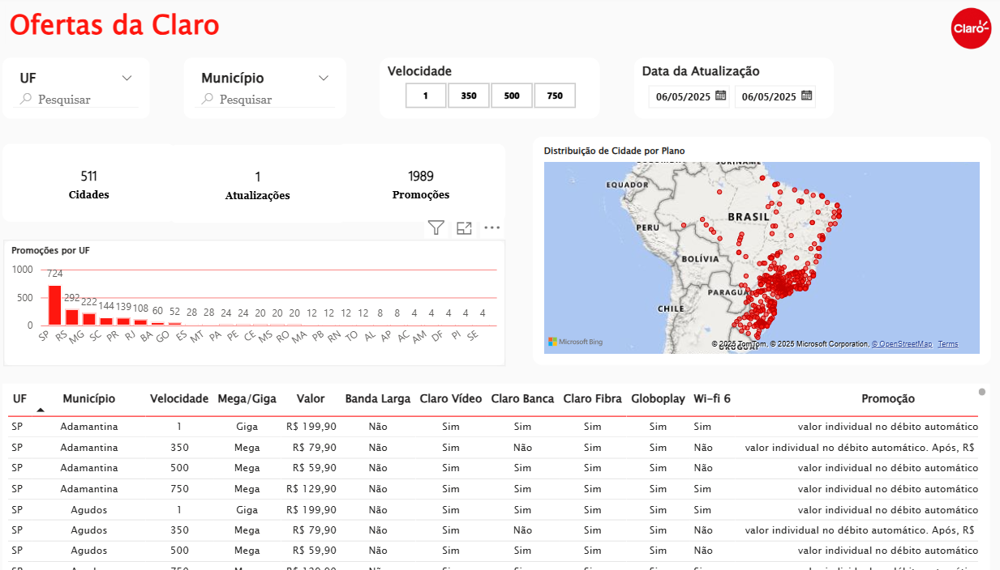

# 📊 Análise da Concorrência

Este projeto contém um dashboard desenvolvido no Power BI com foco na **análise de cobertura e competitividade da operadora Claro**.

## 📸 Demonstração

## 🧠 Objetivo

Avaliar a presença da Claro nos municípios atendidos, identificar pontos fortes e fracos da sua atuação, além de mapear possíveis oportunidades de crescimento com base nos dados coletados.

## 🛠️ Ferramentas Utilizadas

- Power BI
- DAX
- Microsoft Bing Maps
- Tabelas IBGE

## 📌 Principais Insights

- Promoções por UF e município
- Distribuição geográfica por plano
- Detalhamento por velocidade, valor e benefícios

  ## 📎 Observações

> Todos os dados utilizados foram tratados e anonimizados para fins de estudo e visualização analítica.

---

## 👤 Desenvolvido por

[Laura Garcias](https://www.linkedin.com/in/laura-garcias-394a7b207)
